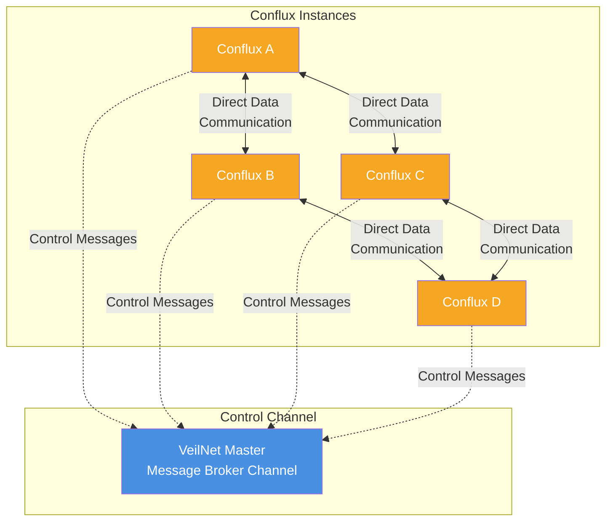
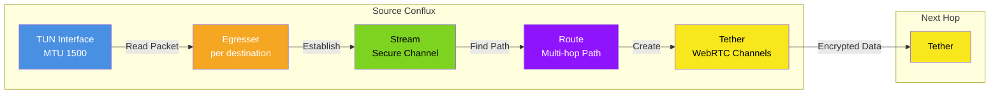
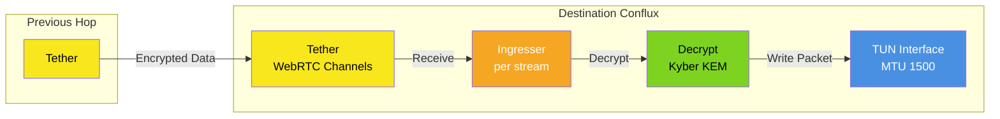
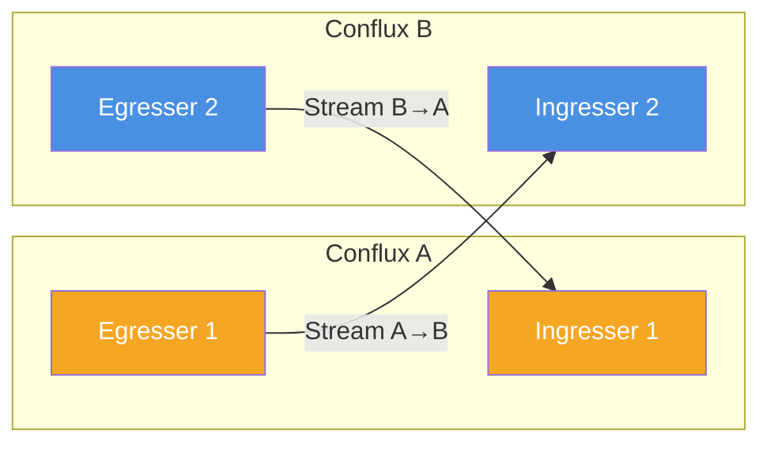
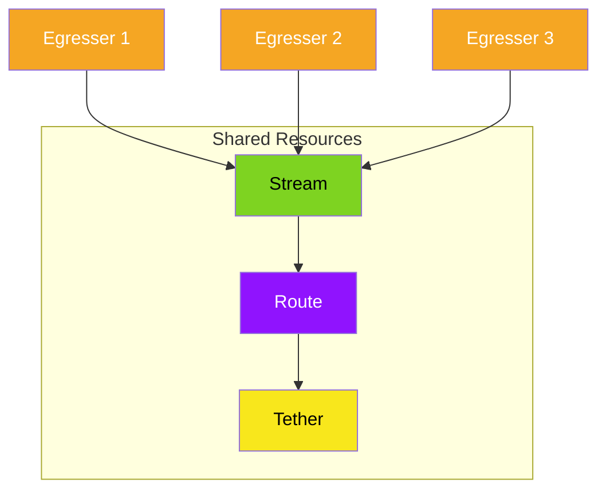
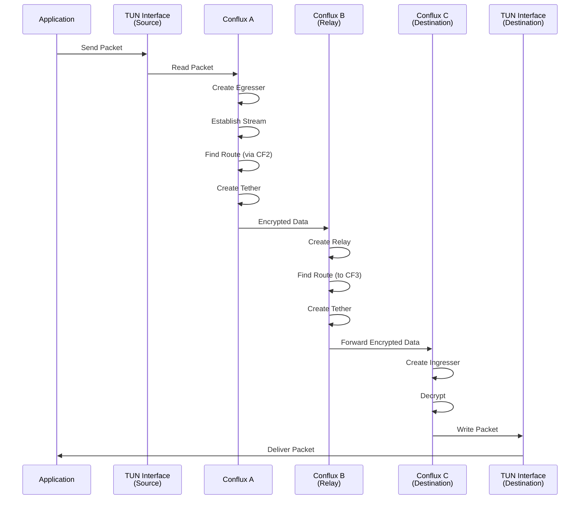

# VeilNet Conflux

VeilNet Conflux is a networking service that connects to VeilNet, a decentralized post-quantum secure network. For installation, configuration, and usage, see the [official documentation](https://docs.veilnet.app).

---

## Important notices

> [!IMPORTANT]
> **Beta v1.0.2+:** The guardian server is now updated to support Beta v1.0.2 and above. An explicit `--guardian` URL is no longer needed. Old registration tokens no longer work; all public realms except **Terra** (realm ID: `5b398d11-a795-4c5b-aa4a-e2d4d93e825a`) have been removed. If you deployed Conflux previously, you must re-deploy with Beta v1.0.2 (use Docker image tag `Beta-v1.0.2`). There should be no more breaking changes.

> [!WARNING]
> **Access control:** Due to the change of access control, Conflux nodes by default will not be able to connect with each other. You must give at least one common taint via `--taints`.

> [!NOTE]
> **Code generation:** A guide for protobuf code generation in Python, JavaScript, C#, Rust, Java, and other languages is available at [docs.veilnet.app/developer/code-generation](https://docs.veilnet.app/developer/code-generation).

---

## How It Works

VeilNet is an ephemeral secure network that differs fundamentally from traditional Peer-to-Peer mesh overlay VPN networks. For detailed information, see the [official documentation](https://docs.veilnet.app).

### Key Components

- **VeilNet Master**: The control-channel message broker that enables the Reinforcement Learning routing algorithm used in the Anchor protocol.
- **VeilNet Guardian**: The authentication server for both users and VeilNet Conflux nodes. User authentication relies on Supabase, while Conflux node authentication uses a JWT system with both long-lived and short-lived tokens.
- **VeilNet Conflux**: The connector software (this project) that runs on virtual or physical machines, as well as container environments, to form the decentralized network.

### Key Differences from Traditional VPNs

- **No Coordination Server**: VeilNet is a decentralized network with no central server managing network state. The network forms automatically through VeilNet Conflux nodes. Encryption keys and routing decisions are generated at runtime and never stored. Conflux nodes do not synchronize configuration files.
- **Non-mesh and Ephemeral**: Data channels between nodes are created on demand and dissolve when idle. No connection is persistent. Multi-hop transmission is natively supported by the Anchor protocol, resulting in a topology that is never fixed or static.
- **Post-Quantum Cryptography**: VeilNet uses Kyber Key Exchange Mechanism and Dilithium Digital Signature, providing post-quantum security. It uses symmetric encryption (AES-GCM-256) rather than asymmetric encryption, with no public or private keys.

### How VeilNet Conflux Works

When a VeilNet Conflux instance starts:

1. **Authentication**: The instance authenticates with VeilNet Guardian using a registration token or conflux token, receiving a certificate that permits joining the global control channel.
2. **Network Formation**: The instance joins the decentralized network through the control channel (a NATS super cluster), exchanging information with other authenticated nodes at runtime.
3. **Encryption & Routing**: 
   - Each Conflux derives shared secrets locally using Kyber KEM
   - Packets are authenticated using Dilithium digital signatures
   - Routing uses a multi-agent cooperative reinforcement learning algorithm
   - Routes are established dynamically: **streams** (logical secure channels), **routes** (multi-hop forwarding), and **tethers** (aggregated WebRTC data channels)
4. **Access Control**: Identity-based access control is enforced at the Conflux instance level. Only verified instances may communicate; untrusted instances are silently ignored.
5. **Self-Healing**: Conflux instances automatically handle load balancing and route switching, self-healing from network failures and guaranteeing data delivery unless the destination is offline.

VeilNet Conflux instances can automatically serve as relays for other verified instances without any configuration, significantly reducing the need for external relays.

## How VeilNet Compares

Not all secure networks are created equal. The following table compares VeilNet with traditional VPN solutions:

| Feature | WireGuard | Tailscale | VeilNet |
|---------|-----------|-----------|---------|
| **Architecture** | Centralised Hub | P2P Mesh | **Decentralised Non-Mesh Overlay** |
| **Encryption** | ChaCha20 & Poly1035 | ChaCha20 & Poly1035 | **Kyber KEM & Dilithium DSA & AES-GCM 256** |
| **Routing** | Static Route Table | Static Route Table | **Reinforcement Learning** |
| **Resilience** | Single-point failures | No alternative route if P2P fails | **Dynamic Self-recovering Route** |
| **Scalability Complexity** | Not possible for scaling | Exponential increase | **Linear increase** |
| **Tunneling** | Static Tunnel | Static Tunnel + NAT Traversal | **Ephemeral Link + WebRTC** |
| **Set-up** | Manual Config | Central Coordination Server | **Self-config with decentralised control plane** |
| **Software Defined Network** | N/A | Limited | **AI-Powered** |
| **Geo-location Control** | N/A | N/A | **Yes** |
| **Deployment Complexity** | High | Medium | **Easy** |
| **Access Control** | N/A | Complex Json-based & Subnet Level | **Easy Identity Affinity & Packet Level** |
| **Current Multi-link Transmission** | N/A | N/A | **Yes** |
| **Peer Relay / Multi-Hop** | N/A | Manual Config & Experimental | **Self-Learning & Natively Supported** |

For more details, visit the [VeilNet homepage](https://veilnet.net/).

## How Connectivity is Established

VeilNet establishes connectivity through a decentralized, ephemeral architecture that differs fundamentally from traditional overlay VPNs.

### Control Channel (VeilNet Master)

All Conflux instances connect to **VeilNet Master**, the control channel (not a server entity) implemented as a NATS super cluster. The Master is a message broker channel that simply relays control messages between Conflux instances. It does not control the network, manage network state, or make routing decisions. This allows nodes to exchange routing information, discover paths, and coordinate without a central coordination server managing network state.

**Note**: VeilNet Master is a **channel**, not a server entity. It only relays control messages and does not manage network state or routing decisions.

### Data Transmission Flow

#### Outbound (Egress) Path

When a Conflux instance needs to send data:

1. **TUN Interface**: The Conflux reads packets from the TUN interface (MTU 1500, with jumbo frame support planned for the future).

2. **Egresser Creation**: For each destination, the Conflux creates an **egresser** (outbound handler) that manages the transmission to that specific destination.

3. **Stream Establishment**: The egresser establishes a secure **stream** via the Anchor protocol. A stream is a logical secure channel per destination.

4. **Route Discovery**: The egresser finds a multi-hop or direct path as a **route** using the reinforcement learning routing algorithm. Routes can be:
   - Direct (single hop)
   - Multi-hop (through intermediate Conflux instances)

5. **Tether Creation**: The egresser establishes a group of WebRTC data channels as a **tether** to the next hop. A tether aggregates multiple WebRTC data channels for improved performance and reliability.

6. **Data Transmission**: The encrypted data is transmitted to the next hop through the tether.

#### Inbound (Ingress) Path

When a Conflux instance receives data:

1. **Tether Reception**: The Conflux receives data from a tether (WebRTC data channels).

2. **Ingresser Creation**: For each stream, the Conflux creates an **ingresser** (inbound handler) that manages the reception from that specific source.

3. **Decryption**: The ingresser decrypts the message using the shared secret derived via Kyber KEM.

4. **TUN Write**: The decrypted packet is written to the TUN interface, making it available to the local network stack.

### Key Characteristics

- **Uni-directional Streams**: Streams are uni-directional. Transmitting and receiving are independent streams, allowing for asymmetric routing and independent path optimization.

- **Resource Sharing**: Streams, routes, and tethers may be shared by multiple egressers or ingressers, improving efficiency and reducing overhead.

- **WebRTC Data Channels**: Since WebRTC handles data encapsulation and segmentation, the TUN interface created by VeilNet has an MTU of 1500 (with jumbo frame support planned for the future).

- **VXLAN-like Overlay**: This architecture makes VeilNet function like VXLAN but across the internet. Conflux provides access to all host networks, including:
  - VXLAN networks
  - CNI (Container Network Interface) networks
  - Container networks
  - Local networks

### Multi-Hop Routing Example

The following diagram illustrates how data flows through multiple hops in a VeilNet network:

### Advantages Over Traditional Overlay VPNs

Unlike mesh-based overlay VPNs (such as Tailscale, Netbird, ZeroTier, and Nebula), VeilNet:

- **Eliminates Mesh Complexity**: No persistent peerings or exponential connection complexity. Routes are ephemeral and dissolve when idle.

- **Independent of Host Routing**: VeilNet's routing is independent of host routing tables, enabling seamless operation across containers, VMs, bare metal, and multi-cloud infrastructure without subrouters or manual route advertisements.

- **No Configuration Synchronization**: Nodes derive routing and encryption state dynamically at runtime through the decentralized control channel, eliminating the need for persistent configuration files or static peer lists.

- **Post-Quantum Security**: Uses Kyber KEM, Dilithium signatures, and AES-GCM-256 for packet-level authentication suitable for multi-hop forwarding.

This architecture enables VeilNet to operate seamlessly across physical machines, VMs, containers, Kubernetes clusters, and serverless workloads, adapting automatically to dynamic IPs, scaling clusters, and short-lived infrastructure.

## Access Control

VeilNet uses **Realms** for logical networks and identity, **Taints** to control which Conflux nodes can communicate, and **OAuth/JWT** for identity-based registration and packet-level authentication. This is fundamentally different from traditional network policies based on subnets or IP addresses. For detailed information, see the [official access control documentation](https://docs.veilnet.app/devop/access-control/taint), [Realms](https://docs.veilnet.app/veilnet/realm), and [OAuth](https://docs.veilnet.app/devop/access-control/oauth).

### Realms

A **Realm** is a logically defined VeilNet network, scoped at the management, identity, and authorization layers. A Conflux node belongs to exactly one Realm. Realm membership is evaluated at join time and enforced for the node’s lifecycle. Realms define which authority governs membership, which identities are recognized, and which Conflux nodes may participate together.

### Taints

**Taints** are labels you attach to a Conflux node. They control which nodes can talk to each other: two Conflux nodes can communicate only if they share the same registration context (Realm) and their taints are **compatible**—one node’s taints are a superset or subset of the other’s.

Taints are simple labels. Typical uses include region or mesh groupings, role-based alignment, and environment-based restriction (e.g. only nodes in the same environment can communicate).

### OAuth / JWT

VeilNet Conflux can use **OAuth-issued JWTs** for identity-based access control. When you register a Conflux, you can pass a JWT plus JWKS URL, issuer, and audience so Guardian can verify the token. Guardian validates the JWT via JWKS and uses it for packet-level authentication; it does not store the JWT. Any OAuth/OIDC identity provider is supported. For details, see the [official OAuth documentation](https://docs.veilnet.app/devop/access-control/oauth).

### How Access Control by Taint Works

VeilNet access control is based on **affinity**. For two Conflux instances to communicate, they must be in the same Realm and have compatible taints (subset/superset relationship).

**Examples**:
- A staging server with taints `dev,stage` can talk to a dev server with taints `dev` (subset), or to another staging server with `dev,stage`.
- A production server with taint `prod` only talks to nodes that also have `prod` in their taint set.

Taints can be set at registration or managed at runtime via the CLI. The key principle: implement access control **based on your business logic, rather than IP address or subnet**. For setup and usage, see the [official documentation](https://docs.veilnet.app).

## Support

For installation and usage, see the [official documentation](https://docs.veilnet.app). For issues, questions, or contributions, please visit the [GitHub repository](https://github.com/veil-net/conflux).

## License

VeilNet © 2025 by Yifei Ren is licensed under CC BY-NC 4.0. To view a copy of this license, visit [https://creativecommons.org/licenses/by-nc/4.0/](https://creativecommons.org/licenses/by-nc/4.0/).
