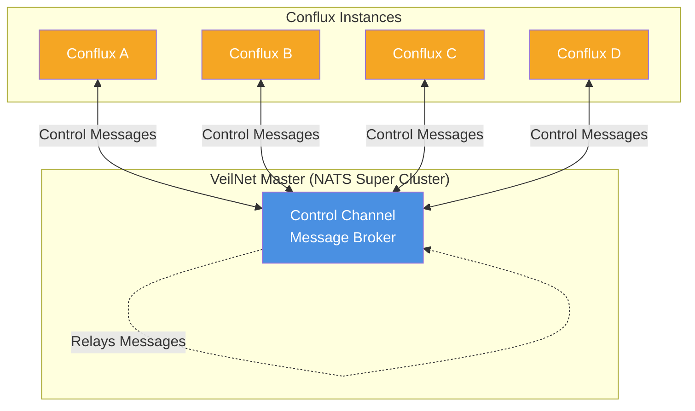
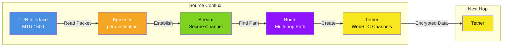
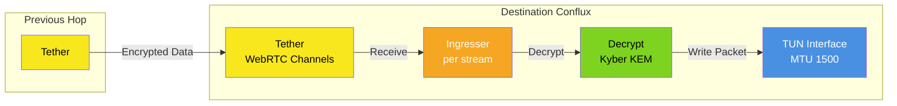
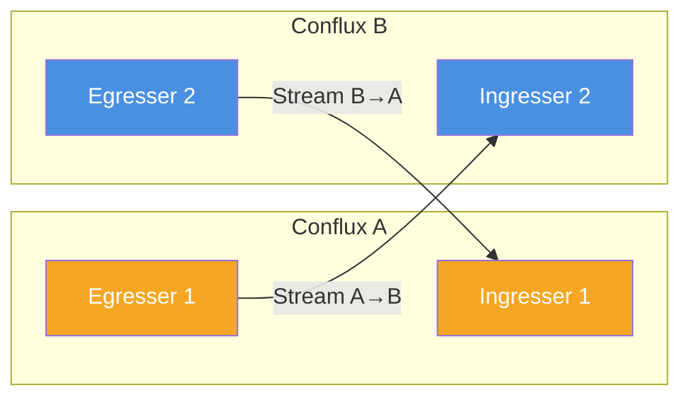
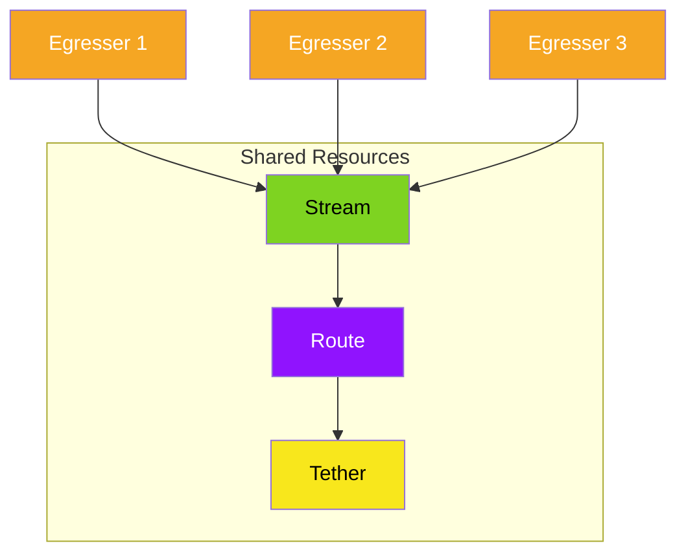
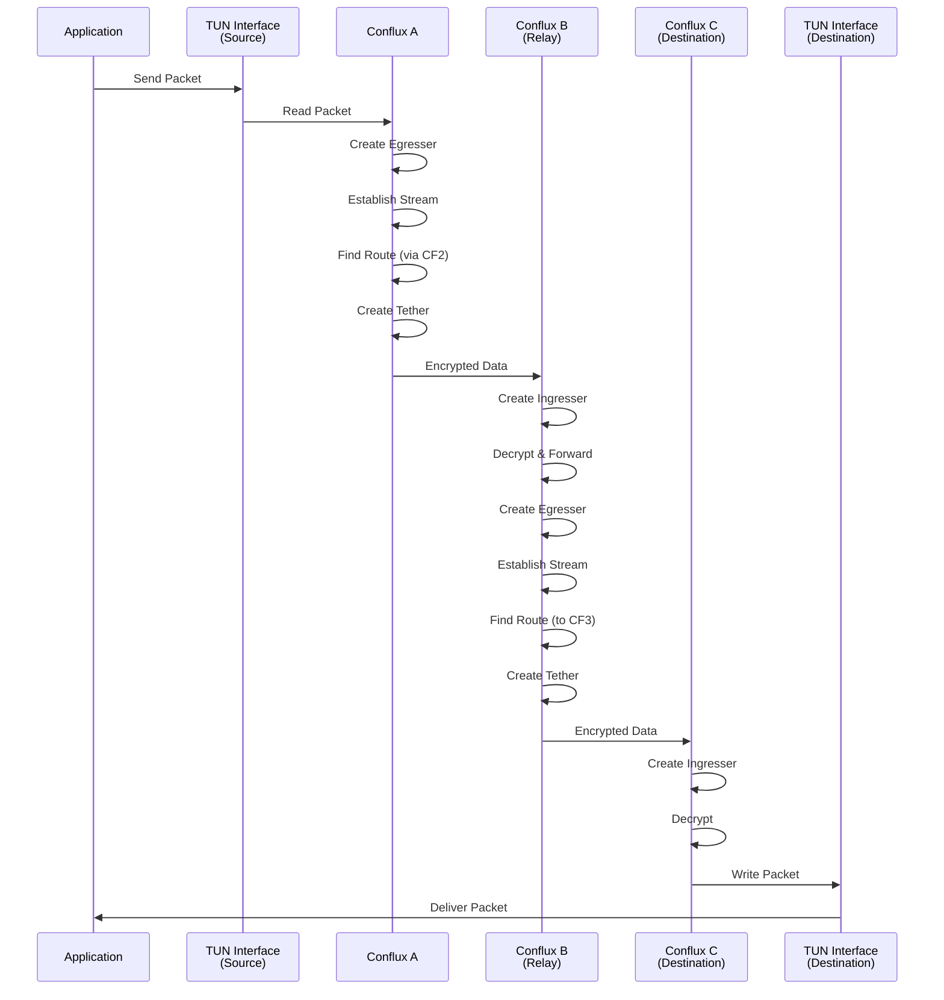

# VeilNet Conflux

VeilNet Conflux is a networking service that connects to VeilNet, a decentralized post-quantum secure network. This guide covers installation and deployment options.

## How It Works

VeilNet is an ephemeral secure network that differs fundamentally from traditional Peer-to-Peer mesh overlay VPN networks. For detailed information, see the [official documentation](https://veilnet.net/docs).

### Key Components

- **VeilNet Master**: The control-channel message broker that enables the Reinforcement Learning routing algorithm used in the Anchor protocol.
- **VeilNet Guardian**: The authentication server for both users and VeilNet Conflux nodes. User authentication relies on Supabase, while Conflux node authentication uses a JWT system with both long-lived and short-lived tokens.
- **VeilNet Conflux**: The connector software (this project) that runs on virtual or physical machines, as well as container environments, to form the decentralized network.

### Key Differences from Traditional VPNs

- **No Coordination Server**: VeilNet is a decentralized network with no central server managing network state. The network forms automatically through VeilNet Conflux nodes. Encryption keys and routing decisions are generated at runtime and never stored. Conflux nodes do not synchronize configuration files.
- **Non-mesh and Ephemeral**: Data channels between nodes are created on demand and dissolve when idle. No connection is persistent. Multi-hop transmission is natively supported by the Anchor protocol, resulting in a topology that is never fixed or static.
- **Post-Quantum Cryptography**: VeilNet uses Kyber Key Exchange Mechanism and Dilithium Digital Signature, providing post-quantum security. It uses symmetric encryption (AES-GCM-256) rather than asymmetric encryption, with no public or private keys.

### How VeilNet Conflux Works

When a VeilNet Conflux instance starts:

1. **Authentication**: The instance authenticates with VeilNet Guardian using a registration token or conflux token, receiving a certificate that permits joining the global control channel.
2. **Network Formation**: The instance joins the decentralized network through the control channel (a NATS super cluster), exchanging information with other authenticated nodes at runtime.
3. **Encryption & Routing**: 
   - Each Conflux derives shared secrets locally using Kyber KEM
   - Packets are authenticated using Dilithium digital signatures
   - Routing uses a multi-agent cooperative reinforcement learning algorithm
   - Routes are established dynamically: **streams** (logical secure channels), **routes** (multi-hop forwarding), and **tethers** (aggregated WebRTC data channels)
4. **Access Control**: Identity-based access control is enforced at the Conflux instance level. Only verified instances may communicate; untrusted instances are silently ignored.
5. **Self-Healing**: Conflux instances automatically handle load balancing and route switching, self-healing from network failures and guaranteeing data delivery unless the destination is offline.

VeilNet Conflux instances can automatically serve as relays for other verified instances without any configuration, significantly reducing the need for external relays.

## How Connectivity is Established

VeilNet establishes connectivity through a decentralized, ephemeral architecture that differs fundamentally from traditional overlay VPNs. For a comparison with other overlay VPN solutions, see the [official comparison documentation](https://veilnet.net/docs/veilnet-vs-overlay-vpns/).

### Control Channel (VeilNet Master)

All Conflux instances connect to **VeilNet Master**, the control channel message broker implemented as a NATS super cluster. The Master does not control the network; it simply relays control messages between Conflux instances. This allows nodes to exchange routing information, discover paths, and coordinate without a central coordination server managing network state.



**Note**: The Master only relays control messages. It does not manage network state or routing decisions.

### Data Transmission Flow

#### Outbound (Egress) Path

When a Conflux instance needs to send data:

1. **TUN Interface**: The Conflux reads packets from the TUN interface (MTU 1500, with jumbo frame support planned for the future).

2. **Egresser Creation**: For each destination, the Conflux creates an **egresser** (outbound handler) that manages the transmission to that specific destination.

3. **Stream Establishment**: The egresser establishes a secure **stream** via the Anchor protocol. A stream is a logical secure channel per destination.

4. **Route Discovery**: The egresser finds a multi-hop or direct path as a **route** using the reinforcement learning routing algorithm. Routes can be:
   - Direct (single hop)
   - Multi-hop (through intermediate Conflux instances)

5. **Tether Creation**: The egresser establishes a group of WebRTC data channels as a **tether** to the next hop. A tether aggregates multiple WebRTC data channels for improved performance and reliability.

6. **Data Transmission**: The encrypted data is transmitted to the next hop through the tether.



#### Inbound (Ingress) Path

When a Conflux instance receives data:

1. **Tether Reception**: The Conflux receives data from a tether (WebRTC data channels).

2. **Ingresser Creation**: For each stream, the Conflux creates an **ingresser** (inbound handler) that manages the reception from that specific source.

3. **Decryption**: The ingresser decrypts the message using the shared secret derived via Kyber KEM.

4. **TUN Write**: The decrypted packet is written to the TUN interface, making it available to the local network stack.



### Key Characteristics

- **Uni-directional Streams**: Streams are uni-directional. Transmitting and receiving are independent streams, allowing for asymmetric routing and independent path optimization.



- **Resource Sharing**: Streams, routes, and tethers may be shared by multiple egressers or ingressers, improving efficiency and reducing overhead.



- **WebRTC Data Channels**: Since WebRTC handles data encapsulation and segmentation, the TUN interface created by VeilNet has an MTU of 1500 (with jumbo frame support planned for the future).

- **VXLAN-like Overlay**: This architecture makes VeilNet function like VXLAN but across the internet. Conflux provides access to all host networks, including:
  - VXLAN networks
  - CNI (Container Network Interface) networks
  - Container networks
  - Local networks

### Multi-Hop Routing Example

The following diagram illustrates how data flows through multiple hops in a VeilNet network:



### Advantages Over Traditional Overlay VPNs

Unlike mesh-based overlay VPNs (such as Tailscale, Netbird, ZeroTier, and Nebula), VeilNet:

- **Eliminates Mesh Complexity**: No persistent peerings or exponential connection complexity. Routes are ephemeral and dissolve when idle.

- **Independent of Host Routing**: VeilNet's routing is independent of host routing tables, enabling seamless operation across containers, VMs, bare metal, and multi-cloud infrastructure without subrouters or manual route advertisements.

- **No Configuration Synchronization**: Nodes derive routing and encryption state dynamically at runtime through the decentralized control channel, eliminating the need for persistent configuration files or static peer lists.

- **Post-Quantum Security**: Uses Kyber KEM, Dilithium signatures, and AES-GCM-256 for packet-level authentication suitable for multi-hop forwarding.

This architecture enables VeilNet to operate seamlessly across physical machines, VMs, containers, Kubernetes clusters, and serverless workloads, adapting automatically to dynamic IPs, scaling clusters, and short-lived infrastructure.

## Access Control

VeilNet uses identity-based access control through **Teams**, which is fundamentally different from traditional network policies based on subnets or IP addresses. For detailed information, see the [official access control documentation](https://veilnet.net/docs/access-control/).

### What is a Team?

A **Team** in VeilNet is an identity that can be associated with Planes, Users, and VeilNet Conflux instances. It's similar to "Taint" for a node in a Kubernetes cluster, which defines affinities.

Each Team has its own cryptographic hash signature that is used by VeilNet Conflux, along with Dilithium Digital Signature for authentication in a decentralized manner. This means VeilNet Conflux maintains access control even if the VeilNet Guardian server is offline.

### How Access Control Works

VeilNet's identity-based access control is possible because VeilNet Conflux is capable of **packet-level user authentication**, which is impossible for other overlay networks based on IP networks and WireGuard.

1. **Team Association**: After a VeilNet Conflux instance authenticates with the VeilNet Guardian server and joins VeilNet, it pulls down its associated Teams (identities) granted by the owner.

2. **Packet Authentication**: 
   - When a packet is sent, a cryptographic hash is created from each identity based on the VeilNet Conflux instance's Dilithium public key
   - When a packet is received, the VeilNet Conflux calculates the cryptographic hash of its own identities based on the sender's Dilithium public key
   - Access is granted only if at least one hash matches (affinity exists)

3. **Security**: The identities are never shared on the network, are globally verifiable, and are unique to each VeilNet Conflux instance. Impersonation is impossible because:
   - **Impersonating Dilithium Public Key is impossible**: The pair of Dilithium public key and instance signature is immutable and announced when an instance joins the network
   - **Impersonating Identity Hashes is impossible**: Without the private key (stored only in memory), a malicious instance cannot produce valid packet Dilithium DSA signatures

### Associating Teams with Conflux

There are two ways to associate Team identities with a Conflux instance:

1. **Via CLI during registration**: Use the `--teams` flag (or `VEILNET_CONFLUX_TEAMS` environment variable) followed by a comma-separated list of teams:
   ```bash
   ./veilnet-conflux register -t "your-registration-token" --teams "team1,team2"
   ```
   The Conflux instance will acquire those identities if the user is a member or owner of the team. Otherwise, the team will be ignored.

2. **Via UI**: Head to the Conflux management page on the [Auth Portal](https://auth.veilnet.app). Expand the Conflux card under any Plane. If the Conflux instance is operating in Portal Mode, click on team chips to add or remove team identities. Changes take effect immediately without requiring a reboot.

### How Access Control by Team Works

VeilNet access control is based on **affinity**. For two Conflux instances to communicate, they must share at least one common Team identity.

**Example**: 
- By default, following the Zero-Trust principle, Conflux instances only have the user identity
- If James wants to access Ben's local network, Ben's Conflux instance will silently drop all messages because they don't share any common identities
- To allow access, Ben must create a Team, invite James as a member, and associate the Team with both Conflux instances
- Now James and Ben can access each other's networks

A VeilNet Conflux instance can be associated with multiple teams to enable complex access control scenarios:
- A staging server associated with both "Dev" and "Stage" teams
- A development server associated with only the "Dev" team
- A production server associated with only the "Prod" team

The key principle: implement access control **based on your business logic, rather than IP address or subnet**.

## Installation

Download the latest release from [GitHub Releases](https://github.com/veil-net/conflux/releases) for your platform.

### Linux

1. Download the binary for your architecture
2. Make it executable:
   ```bash
   chmod +x veilnet-conflux
   ```
3. Move it to a system path (optional):
   ```bash
   sudo mv veilnet-conflux /usr/local/bin/
   ```

### Windows

1. Download the Windows binary from releases
2. Extract and place the executable in your desired location

### macOS

1. Download the macOS binary from releases
2. Make it executable:
   ```bash
   chmod +x veilnet-conflux
   ```

## System Service Installation (Primary Method)

The primary method for installing and managing VeilNet Conflux is using the `register` and `unregister` commands. These commands handle registration with VeilNet and automatic service installation.

### Registering a Conflux

The `register` command registers your conflux with VeilNet, saves the configuration, and automatically installs and starts the system service.

#### Required Parameters

- **Registration Token**: Obtained from [https://auth.veilnet.app](https://auth.veilnet.app)
  - Environment variable: `VEILNET_REGISTRATION_TOKEN`
  - Command flag: `-t` or `--token`

#### Optional Parameters

- **Guardian URL**: The Guardian authentication server URL (default: `https://guardian.veilnet.app`)
  - Environment variable: `VEILNET_GUARDIAN`
  - Command flag: `-g` or `--guardian`

- **Tag**: A tag for identifying the conflux
  - Environment variable: `VEILNET_CONFLUX_TAG`

- **CIDR**: The CIDR block for the conflux network
  - Environment variable: `VEILNET_CONFLUX_CIDR`

- **Portal Mode**: Enable portal mode (default: `false`)
  - Environment variable: `VEILNET_PORTAL` (set to `true` to enable)
  - Command flag: `-p` or `--portal`

- **Teams**: Comma-separated list of teams to forward (e.g., `team1,team2`)
  - Environment variable: `VEILNET_CONFLUX_TEAMS`

#### Examples

**Using environment variables (Linux/macOS):**
```bash
export VEILNET_REGISTRATION_TOKEN="your-registration-token"
export VEILNET_CONFLUX_TAG="my-conflux"
export VEILNET_GUARDIAN="https://guardian.veilnet.app"
./veilnet-conflux register
```

**Using command flags:**
```bash
./veilnet-conflux register -t "your-registration-token" --tag "my-conflux" -g "https://guardian.veilnet.app"
```

**Windows (PowerShell):**
```powershell
$env:VEILNET_REGISTRATION_TOKEN="your-registration-token"
$env:VEILNET_CONFLUX_TAG="my-conflux"
.\veilnet-conflux.exe register
```

The `register` command will:
1. Remove any existing service
2. Register the conflux with VeilNet
3. Save the registration data to the configuration directory
4. Install and start the system service

### Unregistering a Conflux

To remove the service and unregister from VeilNet:

```bash
./veilnet-conflux unregister
```

This command will:
1. Unregister the conflux from VeilNet
2. Stop and remove the system service
3. Remove the registration configuration file

### Service Management

Once registered, you can manage the service using standard system commands:

**Linux (systemd):**
```bash
# Check status
sudo systemctl status veilnet

# Start service
sudo systemctl start veilnet

# Stop service
sudo systemctl stop veilnet

# Restart service
sudo systemctl restart veilnet

# View logs
sudo journalctl -u veilnet -f
```

**Windows:**
```powershell
# Check status
Get-Service "VeilNet Conflux"

# Start service
Start-Service "VeilNet Conflux"

# Stop service
Stop-Service "VeilNet Conflux"
```

**macOS:**
```bash
# Check status
sudo launchctl list | grep org.veilnet.conflux

# Start service
sudo launchctl start org.veilnet.conflux

# Stop service
sudo launchctl stop org.veilnet.conflux
```

You can also use the conflux CLI commands:
```bash
./veilnet-conflux start    # Start the service
./veilnet-conflux stop     # Stop the service
./veilnet-conflux status   # Check service status
./veilnet-conflux remove   # Remove the service (without unregistering)
```

## Alternative Method for Integration (Secondary)

The `up` and `down` commands are designed for integration into other applications or programs. They use a conflux token directly (rather than a registration token) and are suitable for programmatic use.

### Using the `up` Command

The `up` command starts the service with a conflux token directly, without registering with VeilNet.

#### Required Parameters

- **Conflux Token**: The conflux token (not a registration token)
  - Environment variable: `VEILNET_CONFLUX_TOKEN`
  - Command flag: `-t` or `--token`

#### Optional Parameters

- **Guardian URL**: The Guardian authentication server URL (default: `https://guardian.veilnet.app`)
  - Environment variable: `VEILNET_GUARDIAN`
  - Command flag: `-g` or `--guardian`

- **Portal Mode**: Enable portal mode (default: `false`)
  - Environment variable: `VEILNET_PORTAL` (set to `true` to enable)
  - Command flag: `-p` or `--portal`

#### Example

```bash
export VEILNET_CONFLUX_TOKEN="your-conflux-token"
./veilnet-conflux up
```

Or using command flags:
```bash
./veilnet-conflux up -t "your-conflux-token" -g "https://guardian.veilnet.app"
```

The `up` command will:
1. Remove any existing service
2. Save the configuration to `up.json` (separate from registration data)
3. Install and start the system service

### Using the `down` Command

To stop and remove the service started with `up`:

```bash
./veilnet-conflux down
```

This command will:
1. Stop and remove the system service
2. Remove the `up.json` configuration file

**Note**: The `up`/`down` method saves configuration to `up.json`, which is separate from the registration data used by `register`/`unregister`. Use this method when integrating conflux into other applications or when you already have a conflux token.

## Docker Container Deployment

VeilNet Conflux can be deployed as a Docker container using the pre-built image.

### Prerequisites

- Docker and Docker Compose installed
- A `.env` file with required environment variables

### Environment Variables

Create a `.env` file in the same directory as your `docker-compose.yml`:

```env
VEILNET_CONFLUX_TOKEN=your-conflux-token
VEILNET_GUARDIAN=https://guardian.veilnet.app
VEILNET_PORTAL=false
```

### Docker Compose

Use the provided `docker-compose.yml`:

```yaml
services:
  veilnet-conflux:
    image: veilnet/conflux:beta
    container_name: veilnet-conflux
    pull_policy: always
    restart: unless-stopped
    privileged: true
    network_mode: host
    env_file:
      - .env
```

**Important Notes:**
- The container requires `privileged: true` for network operations
- The container uses `network_mode: host` for direct network access
- The image is pulled from the registry: `veilnet/conflux:beta`

### Running the Container

1. Create your `.env` file with the required environment variables
2. Start the container:
   ```bash
   docker-compose up -d
   ```

3. View logs:
   ```bash
   docker-compose logs -f
   ```

4. Stop the container:
   ```bash
   docker-compose down
   ```

### Using Docker Run

Alternatively, you can run the container directly:

```bash
docker run -d \
  --name veilnet-conflux \
  --privileged \
  --network host \
  --restart unless-stopped \
  -e VEILNET_CONFLUX_TOKEN="your-conflux-token" \
  -e VEILNET_GUARDIAN="https://guardian.veilnet.app" \
  veilnet/conflux:beta
```

## Configuration Storage

- **Linux**: `/root/.config/conflux/`
  - Registration data: `/root/.config/conflux/conflux.json`
  - Up data: `/root/.config/conflux/up.json`

- **Windows**: `C:\Windows\System32\config\systemprofile\AppData\Roaming\conflux\`
  - Registration data: `conflux.json`
  - Up data: `up.json`

- **macOS**: `/var/root/Library/Application Support/conflux/`
  - Registration data: `conflux.json`
  - Up data: `up.json`

Environment variables take precedence over saved configuration files.

## Support

For issues, questions, or contributions, please visit the [GitHub repository](https://github.com/veil-net/conflux).

